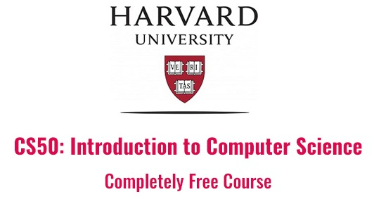

# CS50
**CC50** - Introdução à Ciência da Computação.  
**CS50** - Computer Science 50. 

  
  

### 12 semanas - 6 a 18 horas por semana (216 horas) 

**Instituição:**  HarvardX  
**Assunto:**  Ciência da Computação   
**Nível:**  Introdutório  
**Pré requisitos:**  Não  
**Linguagem:** English  
**Legendas:** Habilitar legenda automática do youtube para os vídeos e tradução dos textos com a [Extensão do Google Tradutor](https://chrome.google.com/webstore/detail/google-translate/aapbdbdomjkkjkaonfhkkikfgjllcleb?hl=pt)

 &nbsp;IDE Online 

 
# Grade do Curso:
[Introdução](introducao.md)  
[Week 0's (Módulo 0 - Scratch)](0-Scratch.md)  
[Week 1's (Módulo 1 - C)](1-C.md)    
[Week 2's (Módulo 2 - Arrays)](2-Arrays.md)  
[Week 3's (Módulo 3 - Algoritmos)](3-Algoritmos.md)  
[Week 4's (Módulo 4 - Memória)](4-Memoria.md)  
[Week 5's (Módulo 5 - Estrutura de Dados)](5-EstruturaDeDados.md)  
[Week 6's (Módulo 6 - Python)](6-Python.md)  
[Week 7's (Módulo 7 - SQL)](7-Sql.md)  
[Week 8's (Módulo 8 - HTML, CSS, JavaScript)](8-HtmlCssJs.md)  
[Week 9's (Módulo 9 - Flask)](9-Flask.md)  
[Week 10's (Módulo 10 - Ética)](10-Ética.md)  
[Encerramento do Curso]  
[SSH-Keygen - Criando chave SSH para o GitHub](ssh-keygen.md)  
[Erro no debug50](https://patyfil.github.io/cs50-cc50-harvard/debug50)
